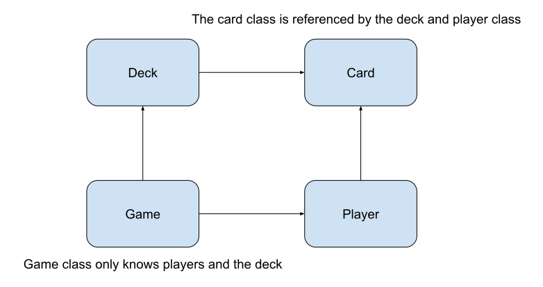
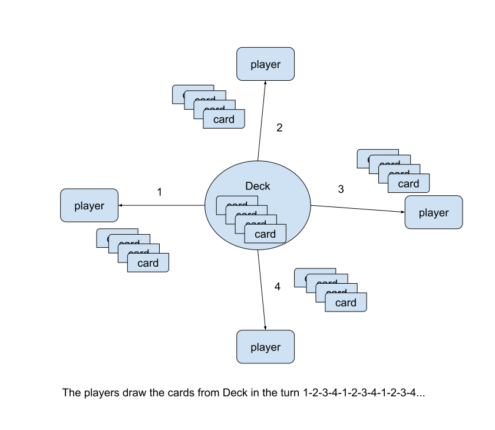

# Code Snippets and Diagrams

## Introduction
This is an assignment to proctice how to code in the way of object-oriented programming. What's the object-oriented programming?  Dividing and isolating the complexity of the problem. The following code snippets and diagrams are used to explain it.

## Assignment - Simple Card Game 

The card game is simple which can be played with 2-52 players. Each player takes turns drawing cards from the pile until there are no cards remaining. Red cards add to the total score, Black cards subtract from the total score. Each player adds up their cards, and the player with the highest total wins the game.

## Dividing the problem
 - **Deck** 
 - **Card**
 - **Player**
 - **Game** 

These classes are used to divided the problems into the different parts. Different parts maintain their own dates and interact with other classes.

## Relationship of the classes

###  Deck
    function  Deck() {
	    this.cards = [];
	}
	Deck.prototype.hasCards = function(){
		return  this.cards.length !== 0
	}
	Deck.prototype.drawCard = function(){
		if(this.hasCards()){
			return  this.cards.pop();
		}else{
			return  null;
		}
	}
	Deck.prototype.initialize = function () {
		for (let  suit = 0; suit < 4; suit++) {
			for (let  rank = 1; rank < 14; rank+){
				this.cards.push(new  Card(suit, rank))
			}
		}
		this.cards.sort(()=>  Math.random() - 0.5)
	}

 
###  Card
    function  Card(suit, rank) {
		this.suit = suit; 
		this.rank = rank;
		this.faceCard = rank > 10 ? true : false;
	}
	Card.prototype.toString = function () {
		return  this.suit + "," + this.rank + "," + this.faceCard;
	}
	Card.prototype.score = function () {
		return  this.suit%2 === 0 ? this.rank : -1 * this.rank;
	};
    
###  Player
    function  Player(name) {
	    this.name = name;
	    this.hand = [];
	}
	Player.prototype.score = function () {
		let total = 0;
		this.hand.forEach(function(card){
			total += card.score()
		})
		return total;
	}
	Player.prototype.draw = function (card) {
		this.hand.push(card);
	}

###  Game

    function Game() {
	    this.players = [];
	    this.deck = new  Deck();
	}
	Game.prototype.scoresToString = function () {
		let result = "";
		this.players.forEach(function(player){
			result += (player.name + ":" + player.score() + "\n");
		})
		return result;
	}
	Game.prototype.play = function (n) {
		//n is the number of the players
		for(let  i=0;i<n;i++){
			this.players.push(new  Player("playerName"+i));
		}
		//draw all the cards on deck;
		this.deck.initialize();
		let drawPlayerIndex = 0;
		while(this.deck.hasCards()){
			if(drawPlayerIndex === this.players.length){
				drawPlayerIndex = 0;
			}
		let card = this.deck.drawCard();
		//console.log(drawPlayerIndex+"->"+card.toString())
		this.players[drawPlayerIndex++].draw(card)
		}
		//print the score of the players
		console.log(this.scoresToString());
		//sort players
		this.players.sort(function(player0,player1){
			return player1.score() - player0.score()
		})
		//print winner
		console.log("winner is:"+ this.players[0].name);
	}

## The play method

## The core method - play()
This function is the core method which contain all logic of the problem. Why this method can solve the problem in such a simple way? The reason is that the other classes method resolve the their own problems.  All the classes work together well and give a solution for the whole problem.

## Runing the code

    const game = new Game();
    game.play(5);

Output of the code:

    playerName0:27
    playerName1:-4
    playerName2:-1
    playerName3:14
    playerName4:-36
    
    winner is:playerName0

## in conclusion
OOP is a useful tool to resolve many complex problems.

