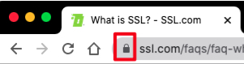

---
{
"path": "post.html#post/SSL.md",
"title": "SSL",
"author": "Chet",
"date": 20201128,
"image": "SSL.header.jpeg",
"summary": "SSL and TLS are protocols for establishing authenticated and encrypted links between networked computers."
}
---
# SSL introduction

## What is SSL? and TLS?
SSL is Secure Sockets Layer; TLS is Transport Layer Security. SSL and TLS are protocols for establishing authenticated and encrypted links between networked computers.(Russell, 2020)

## How can I tell that my web page is secure?
Generally, users can access web pages through insecure http or secure https protocols. For example, If Google Chrome’s address bar shows a lock, we can tell this web page is secure, because the web page is a https website.

Otherwise, if Chrome's address bar shows a warning triangle, the webpage is not secure, because the web page is a http website.

## What does it mean to be secure?
Being secure means users access an HTTPS website. HTTPS can guarantee the security of information, such as((Team, What is SSL? 2019)):
- Authenticity. The server provides the certificate (contains the identity of the server) for the user. Users can trust the sites are the sites they want to visite.
- Integrity. The web pages signed by the certificate are possible to change. users can trust the webpages are not changed in the way to the user.
- Encryption. Communications between the client and server are encrypted and the plaintext is hidden in the way.

## What is encryption and why do I care?
Plaintext translation between computers is not secure while encryption is an important way to protect the user’s plaintext.

## Do the prefixes HTTP or HTTPS matter when we're talking about secure web sites?
The prefixed HTTP or HTTPS matters becauses HTTPS is secure, while HTTP is not secure.

## What is an SSL certificate authority?
SSL certificate as an identity of an entity contains the digital information of the entity. The SSL certificate exists in the form of a public key and opened for the public. SSL certificate authority is a publicly trusted organization which signs certificates for other entities. These entities need the signed SSL certificate to prove they are secure for the public.

## What information do I need/want to be secured?
Personal information to be secured, such as
- Username and password for logging a website.
- Identification, credit, debit cards information, and Social Security Number
- Chat history, email, personal photos

#### References:
1. Russell, A. (2020, July 13). What is HTTPS? Retrieved October 19, 2020, from
https://www.ssl.com/faqs/what-is-https/
2. Rouse, M. (2020, April 16). What is Encryption and How Does it Work? Retrieved October 19,
2020, from https://searchsecurity.techtarget.com/definition/encryption
3. Team, S. (2019, October 02). What is SSL? Retrieved October 19, 2020, from
https://www.ssl.com/faqs/faq-what-is-ssl/