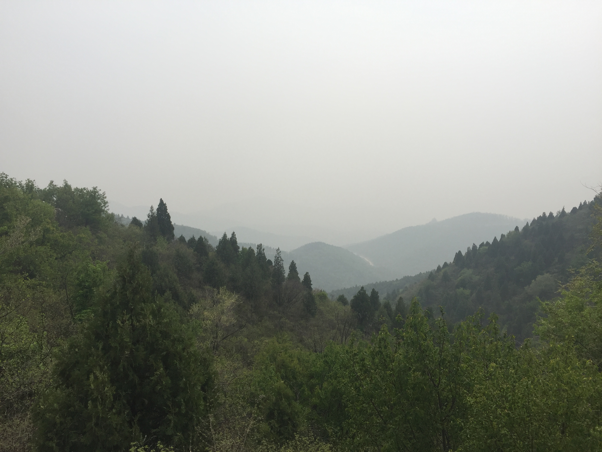
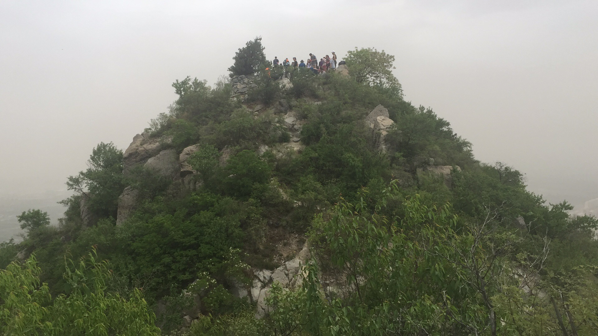

---
{
"path": "post.html#post/about_me.md",
"title": "About Me",
"author": "Chet",
"date": 20201128,
"image": "post/about_me.hill.JPG",
"summary": "Bytes are the only thing you will leave in this world, not bone ashes."
}
---

<!--  -->

### Why Coding
My name is Chao Chen. I grew up in a small town in southern China. When I was a child, I had a dream to become a physicist. However, being a software engineer is my primary goal now because I was born to like to create and design. In the world of software, I can freely create anything that I want to create like God. It may be that I prefer to create my own universe in the software world, rather than understand the rules in our universe.

### Why English

In order to achieve my aim, I want to study software development in English. There are two reasons. First, the 10-month program at Manitoba Institute of Trades
& Technology is enough to get a working knowledge, even though the program doesn't contain a full computer science curriculum. Second, I believe that the English is the best language to master software development. We know that a roject can be built by different computer languages. such as C/C++, Python, Java, Lisp, and so on. However, English is considered the most suitable language as a tool to resolve the problems in the project. This is the reason why i study English and software development in Canada.

### About me

As a geek, I love any new technology. Most of the time, I focus on my own work and don’t like speaking with people. However, I like playing video games with my friends, such as World of Craft. Recently, I am studying the
OpenGL Gl to develop a game like Mincraft for my son. Hiking with my wife is my
favorite sport. I have promised that I will make a tiny house with wheels for my family.

### Mottos

- Life is a test
- Everything is possible
- Coding like doing artistic creation work
- Bytes are the only thing you will leave in this world, not bone ashes.

