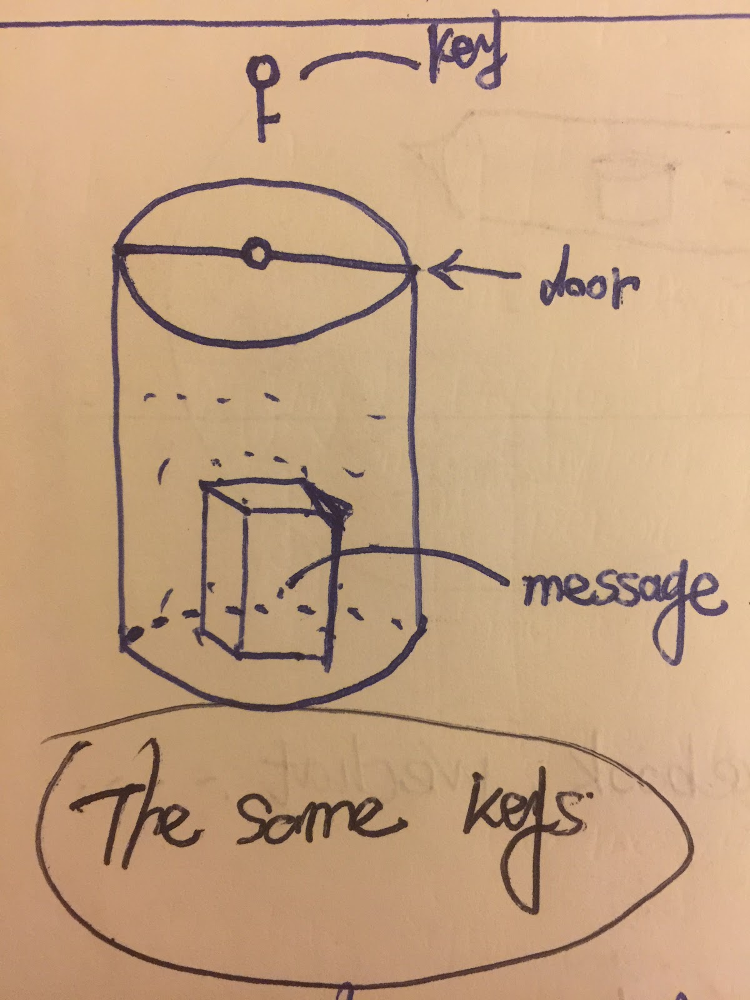
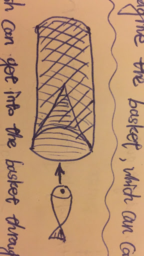
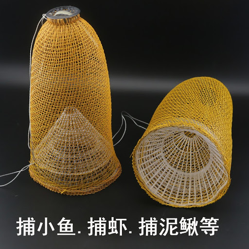
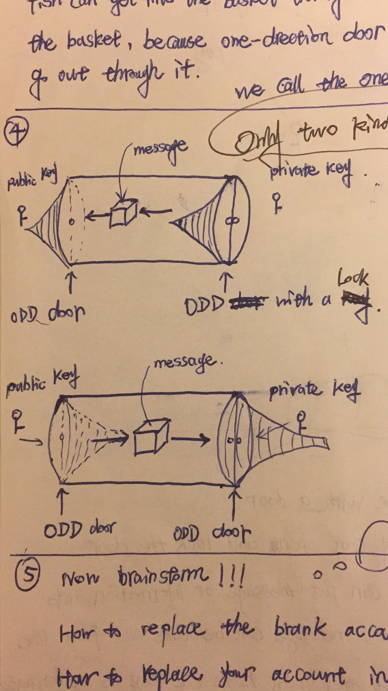

---
{
"path": "post.html#post/encryption_and_decryption.md",
"title": "Encryption and decryption",
"author": "Chet",
"date": 20201128,
"tags":["portfolio"],
"image": "encryption_and_decryption.header.png",
"summary": "What are the principles of encryption and decryption? There are most two common way of encryption and decryption"
}
---
# Encryption and Decryption

What are the principles of encryption and decryption? There are most two common way of encryption and decryption:

## Symmetric encryption algorithm
Imagine that a box has a door and has a message in it, like the following picture.

The box has two components and two actions as the following:
**Components:**
1. A box has a door with a lock
2. A key can open and lock the lock.
**Actions:**
1. unlock, put the message into the box, lock it.
2. unlock, take the message out from the box, lock it.

The components and actions explain the principles of the Symmetric encryption algorithm. For example, a user has a password (key) that encrypts the login information(put the message into the box and lock it). At the same time, the website accepts encrypted information and decrypts the information(unlock the box and get the message).	In conclusion, the website has to know the password of the user because they have the same password(key). If the websites were hacked and the passwords of the users will be leaked. 

## asymmetric encryption algorithm

Before explaining the asymmetric encryption algorithm, we introduce the special door named one-direction door (ODD), as the following picture.

The fishing trap has a key part - a one direction door - through which the fish can go into the trap,  but never go out. Actually, we can buy such a fishing trap on Chinese eBay.

Why explain the one-direction door(ODD), because it plays an important role in the asymmetric encryption algorithm.

As the above picture shows, the box has two ODDs and explains the asymmetric encryption algorithm model with two components and two actions:
**Components:**
1. A box has two ODDs with locks
2. The public key and the private key
**Actions:**
1. Put the message into the box with the private key and take out the message from the box with the public key
2. Put the message into the box with the public key and take out the message from the box with the private key.

# Asymmetric way vs Symmetric way

The components and the actions allow the user to keep a private key as his password and the website keep the public key of the private key. Except for the user, nobody needs to know the private key. The asymmetric encryption algorithm is a safer way to keep the user’s information than the symmetric encryption algorithm. 

# How to be safe

Actually, for almost the website, the username-password way to log in to a website is a not safe way. For example, no matter what method Google uses to encrypt the user’s information, users should treat Google as a box, as the symmetric encryption algorithm box. People input their passwords on the webpage of Google and Google accepts them, knows them. This’s not safe because Google knows the password and nobody can trust, including Google.

The ideal way of password management is that one person is the only one who can keep his/her private key and the others keep the public key. For example, this is a safe way to use google: 

1. User register in Google 

submits the user’s public key to google.

2. Login in Google 

the users receive the encrypted messages for login from google with the public keys, and the users decrypt the messages to prove who they are. This step is a bit like Two-Factor Authentication (2FA), but they are different things?

Another example is Bitcoin wallet. It is just a private key because a real private key as your password is enough to keep your information safe.

