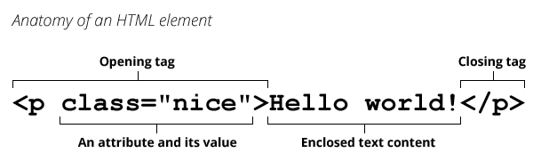
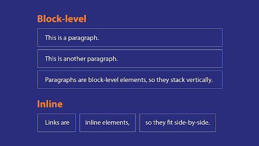

---
{
"path": "post.html#post/html_and_css.md",
"title": "Html and css",
"author": "Chet",
"date": 20201128,
"image": "html_and_css.header.png",
"summary": "Hypertext Markup Language (HTML) is the standard markup language for documents designed to be displayed in a web browser. "
}
---
<!-- # HTML & CSS -->
<!--  -->

## What’s HTML?
Hypertext Markup Language (HTML) is the standard markup language for documents designed to be displayed in a web browser. It can be assisted by technologies such as Cascading Style Sheets (CSS) and scripting languages such as JavaScript.(HTML, 2020) In order words, an HTML document is a set of commands that tell the web browser how to display (or render) the information on the screen.

## Elements and tags
What are elements and tags? HTML contains different elements. The element is the unit a web browser displays. Since the HTML is written with text in the form of a document, the element exists in the form of a tag. Generally, an HTML tag contains data items, such as text, and an image. If an item is an HTML attribute, it belongs to an HTML element. The following image is how an HTML tag is formatted.


(HTML, 2020)

## Inline elements and block elements
Inline elements and block elements are elements that display different layouts in the web page. For example, web pages are made from row contents. The inline elements can stay one by one in one row, but the block element needs a whole row to show its content even though its width is less than the length of the row.

(Basic HTML: Block-level, Inline, and Organizational Elements)

## CSS
What’s CSS? CSS (Cascading Style Sheets) is a declarative language that controls how webpages look in the browser(CSS). CSS is text which is made of element selectors and CSS values. The CSS rule is that the selectors combine the CSS values and the css values determine how the selected elements look. There is a CSS example:

```css
.info-box {
   	text-align: center;
  	 color: red;
   	background-color: black;
}
```

The “.info-box” is a CSS selector which finds the elements whose class contains the info-box and applies their values text-align, color and background-color to the elements.

### References

1. Element. (n.d.). Retrieved November 01, 2020, from https://developer.mozilla.org/en-US/docs/Glossary/Element
2. HTML. (2020, October 29). Retrieved November 01, 2020, from https://en.wikipedia.org/wiki/HTML
3. CSS. (n.d.). Retrieved November 01, 2020, from https://developer.mozilla.org/en-US/docs/Glossary/CSS
4. Basic HTML: Block-level, Inline, and Organizational Elements. (n.d.). Retrieved November 02, 2020, from https://edu.gcfglobal.org/en/basic-html/blocklevel-inline-and-organizational-elements/1/
