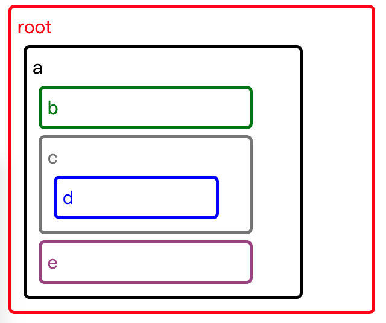

---
{
"path": "post.html#post/include.md",
"title": "Include",
"author": "Chet",
"date": 20201128,
"tags":["portfolio"],
"image": "post/include.header.gif",
"summary": "Include is javascript lib which can include a html in a html."
}
---

## Include
Include is javascript lib which can include a html in a html. 
The most important feature of this lib is that you can include a file which has the ability to include another file, it means the include action is recursive.


## Quick start

```html
<script src="include.js"></script>
//do nothing coding and just add an include tag in your html page
<include src="components/a.html"></include>
```
Or
```html
<script src="include.js"></script>
<script>
//specify the page as the root page to load 
include.load("components/a.html");
</script>
```
Or
```html
<script src="include.js"></script>
<script>
//load current page and add event listener
include.load().addLoadListeners(function(node){
    console.log("All include page has been loaded")
})
</script>
```

## Example

```html
<!-- index.html is a root page containning other pages -->

<style>
  div{
    border: 5px solid red;
    border-radius: 10px;
    color:red;
    padding:10px 10px;
    margin:10px 10px;
    font-size: 30px;
    width: 75%;
  }
</style>
<script src="include.js"></script>
<div>
  root
  <include src="components/a.html"></include>
</div>

<!-- a.html -->

<div style='border-color:black;color:black'>
  a
  <include src="components/b.html"></include>
  <include src="components/c.html"></include>
  <include src="components/e.html"/>
</div>

<!-- b.html -->

<div style='border-color:green;color:green'>
  b
</div>

<!-- c.html -->

<div style='border-color:gray;color:gray'>
  c
  <include src="components/d.html"></include>
</div>

<!-- d.html -->

<div style='border-color:blue;color:blue'>
  d
  <include src="components/c.html"></include>
</div>

<!-- e.html -->

<div style='border-color:rgb(161, 79, 141);color:rgb(161, 79, 141)'>
  e
</div>
```

#### Output 
open index.html with chrome
